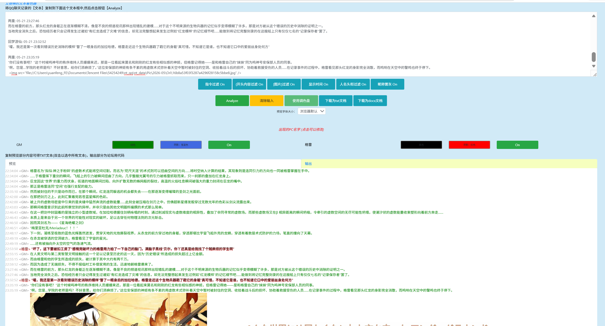
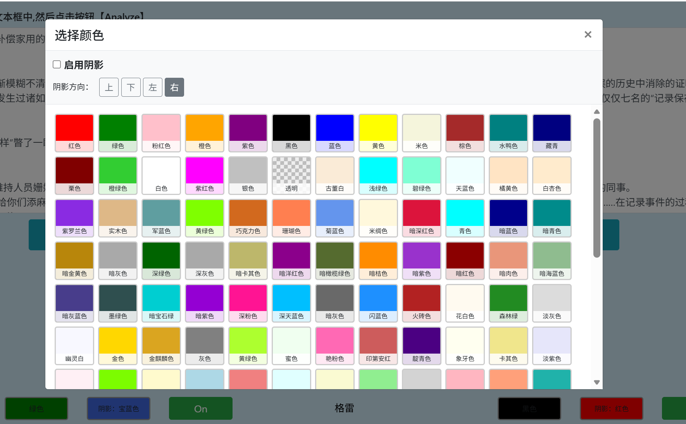

# logPainter
TRPG LogPainter — QQ跑团记录着色器

# 简介

将 QQ 群聊天记录粘贴进来，自动识别发言人并为每位玩家分配颜色，输出带颜色标记的论坛 BBCode 或可下载的 TXT / DOCX 文件。由风羽原版修改而来（溯洄改，两重改）。

项目地址：https://github.com/willyssalu-arch/logPainter

# 功能

## 工作方式

下载 QQ跑团记录着色器.html 即可直接本地单文件使用！
本项目暂未放置远程部署，有需要的人可以自行部署一下！最好也能分享给我！（？
相比原项目增加了大量颜色、昵称置灰、格式兼容、图片展示等，有需要的功能也可以联系咱，咱有空的时候搞搞。





### QQ 聊天记录支持的四种时间戳格式

```
2016-01-03 12:35:30 昵称            ← 格式一（含 AM/PM 可选）
昵称(QQ号) 2016-01-03 12:35:30      ← 格式二
昵称(QQ号) 12:35:30                 ← 格式三（仅时间）
昵称: 01-03 12:35:30                ← 格式四（月-日 时间）
```

## 过滤开关（共 6 个）

| 开关 | 默认 | 作用 |
|---|---|---|
| 指令过滤 | On | 过滤骰子机器人指令（`.r` `.sc` `.en` `.coc` `.dnd` `.st` `.me` 等） |
| (开头内容过滤 | On | 过滤以 `(` 或 `（` 开头的 OOC 内容 |
| [图片]过滤 | On | 移除消息中的 `[图片]` 占位符 |
| 显示时间 | On | 在每条消息前显示时间戳 |
| 人名头衔过滤 | On | 自动去除 QQ 群名片中的 `【头衔】` 前缀，保留纯昵称 |
| 昵称置灰 | On | 昵称用灰色显示，正文保持玩家颜色 |

## 颜色管理

- **预设颜色**（默认模式）：141 种 CSS 命名色，点击「选择颜色」弹出色块面板选取
- **调色盘模式**：点击「使用调色盘」切换，可为每位玩家自由选取任意 RGB 颜色
- 颜色修改后实时刷新预览

## 阴影设置

每位玩家可独立配置文字阴影：

- 点击玩家行的「阴影」按钮，在弹窗中启用阴影、选择阴影颜色与方向（上/下/左/右）
- BBCode 输出格式：`[shadow=颜色,方向]...[/shadow]`
- HTML 预览使用对应的 `text-shadow` CSS

## 预览字体大小

按钮区提供全局「预览字体大小」下拉框，调整范围覆盖浏览器默认至 xx-small / xx-large 及 12–20pt，仅影响 HTML 预览渲染，不写入 BBCode 输出。

## 输入框工具栏

输入框上方右侧提供三个辅助按钮：

| 按钮 | 功能 |
|---|---|
| 复制原文 | 将输入框当前内容规范化后复制到剪贴板，粘贴到其他地方时行数与原文完全一致，不产生多余空行 |
| 📎 插入图片 | 打开本地文件选择器，将所选图片插入到光标所在位置 |
| 🔍 全局替换 | 弹出浮动面板，在输入框全文中批量替换指定词语；留空替换结果则等同于批量删除 |

输入框支持直接 Ctrl+V 粘贴图片（截图、复制的图片文件），图片在分析时会原样保留并在预览中按比例缩略展示，BBCode/TXT 输出中以 `[图片]` 占位。

## 玩家管理

- 自动识别所有发言人并按出场顺序循环分配颜色
- 可在名字框中直接修改显示名称
- 每位玩家有独立 On/Off 开关，关闭后该玩家发言从输出中隐藏
- 系统消息自动过滤，不参与着色

## 输出方式

| 方式 | 说明 |
|---|---|
| 预览 | HTML 渲染，双击可全选 |
| 输出 | 论坛 BBCode，格式为 `[color=颜色]<昵称> 内容[/color]`，点击可全选 |
| 下载为 TXT | 纯文本，保留时间戳和昵称 |
| 下载为 DOCX | Word 文档，保留字体颜色 |

> 调色盘模式下自定义颜色与论坛 BBCode 不兼容，此时只能通过预览全选后粘贴到 Word 保存。

## URL 参数

`?s3=<路径>` — 从 AWS S3 加速节点自动加载日志文本并执行解析（最多重试 3 次）。

# 技术栈

| 库 | 版本 | 用途 |
|---|---|---|
| jQuery | 3.5.1 | DOM 操作 |
| Bootstrap | 4.5.0 | UI 组件与布局 |
| docx.js | 6.0.3 | 生成 DOCX 文件 |
| FileSaver.js | 1.3.8 | 浏览器端文件下载 |
| color-picker | — | 调色盘 UI |

所有依赖均存放于本地 `vendor/` 目录，可在断网环境直接使用。

# 版本历史

| 版本 | 日期 | 改动 |
|---|---|---|
| v2.1 | 2016-01-31 | 初始版本（风羽） |
| v2.2 | 2016-09-17 | — |
| v2.3 | 2017-02-17 | — |
| v2.4 | 2018-02-12 | 界面优化，修正错误，更新依赖（溯洄） |
| v2.5 | 2018-02-12 | 修正错误，更新依赖，新增论坛分享（溯洄） |
| v2.6 | 2021-06-05 | 新增直接下载功能（溯洄） |
| v3.0 | 2026-05-22 | 修改为本地即可使用；颜色选择扩展为 141 色弹窗；新增格式四时间戳解析；每 PC 独立阴影颜色/方向设置（BBCode `[shadow]`）；全局预览字体大小调节；昵称置灰默认开启；输入框支持图片粘贴/插入并保留至分析输出；新增「复制原文」「📎 插入图片」「🔍 全局替换」工具栏按钮；修复 Windows 剪贴板 `\r\n` 导致分析多余空行的问题；移除论坛分享功能；移除第三方追踪代码（两重改） |

# 部署说明

本项目为纯静态页面，部署只需将文件上传至任意静态托管服务（GitHub Pages、Netlify 等）。

`index.html` 为唯一入口文件，所有依赖均为本地文件，无需网络连接即可运行，无任何第三方追踪代码。

# 兼容性

兼容 IE11、Chrome、Firefox、Safari 等现代浏览器。IE 旧版本会显示浏览器不兼容警告。

# License

MIT License — 详见 [LICENSE](LICENSE) 文件。

原作者：风羽 Copyright © 2017-2019 hina.moe  
修改：溯洄 Copyright © 2018-2021 kokona.tech  
修改：两重 Copyright © 2026
